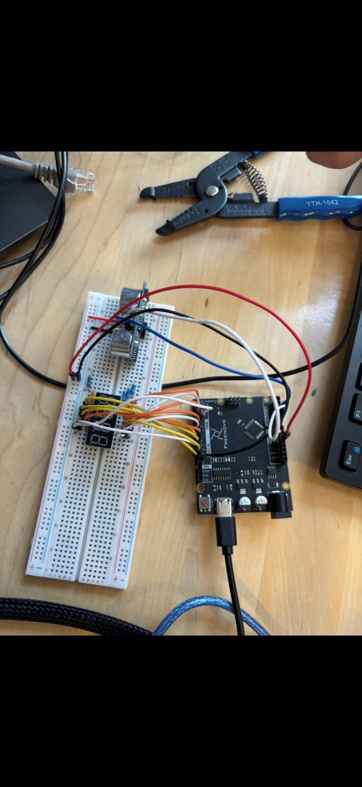
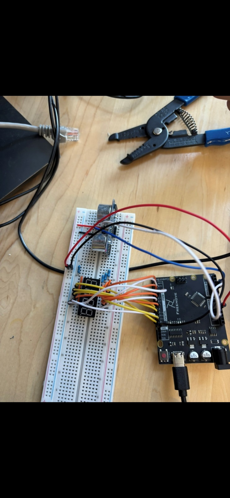

# Ultrasonic Ranging Sensor — Simulated Analog Voltage Display

An Arduino project that turns a digital ultrasonic distance sensor into a simulated analog instrument: it reads distance with an HC-SR04, converts it to a 0.00–5.00 V value through simple scaling math, and displays the result live as `X.XX` on a 4-digit, 7-segment LED display.

## Overview

The goal wasn't just to measure distance — it was to demonstrate how a digital sensor can be made to *behave* like an analog voltage source using nothing but math and multiplexed digital I/O. The HC-SR04 measures the round-trip time of a sound pulse; that time is converted to a distance, and the distance is linearly scaled against a maximum range (400 cm) to produce a 0–5 V equivalent, which is then split into digits and driven onto a common-anode 7-segment display.

## How it works

1. **Sensing:** trigger the HC-SR04, measure echo pulse width with `pulseIn()`
2. **Distance:** `distance = (time_us × 0.000343 m/µs) / 2` (round-trip correction)
3. **Voltage mapping:** `voltage = (distance / 400 cm) × 5.0`, clamped to [0.00, 5.00] with `constrain()`
4. **Digit extraction:** the voltage is multiplied by 100 and rounded, then split into three digits (`X.XX`) plus a blank 4th digit
5. **Display:** the four digits are multiplexed onto the 7-segment display every ~4 ms per digit, cycling fast enough to look simultaneously lit; segment logic is inverted since the display is common-anode

## Materials

Arduino-compatible board (breadboarded on a Freenove Uno-style controller), 4-digit 7-segment display (common anode), HC-SR04 ultrasonic sensor, 1 kΩ resistors ×4, breadboard, jumper wires. Circuit was also simulated in Proteus before breadboarding.

## Wiring

- HC-SR04: VCC → 5V, GND → GND, Trig → pin 15, Echo → pin 16
- 7-segment segments a–g → pins 6, 7, 8, 9, 10, 12, 11; decimal point → pin 13
- Digit-select (common anode) pins → 2, 3, 4, 5
- Each segment pin routed through a 1 kΩ resistor

## Challenges

- Display flicker / dropped digits — fixed by tuning the per-digit multiplexing delay
- Occasional erratic sensor readings — resolved with `constrain()` and clearer line-of-sight for the sensor
- A few segments failing to light initially — traced to wiring mistakes, fixed with resistors added per segment and re-checked connections

## Contents

- `src/ultrasonic_display.ino` — Arduino sketch (sensing, distance→voltage conversion, 7-segment multiplexing)
- `images/` — real breadboard photos of the wired circuit
